# CodexMinimal

Minimal harness layer for Codex CLI.

CodexMinimal không cố trở thành một super-agent. Nó đóng vai trò `harness / orchestrator layer` để:

- route task
- giữ rule và project memory
- giữ user-mediated learning memory cho lỗi lặp lại và feedback lặp lại
- ép feature đi qua `brainstorm -> spec -> phase plan`
- quản phase plan, tracker, runtime state
- refresh index sau khi work hoàn tất

## Overview

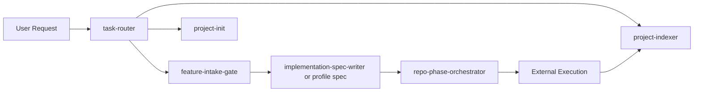

## Harness Layer

`CodexMinimal` không cố làm execution engine. Nó là lớp điều phối để ép LLM đi đúng flow, giữ state, và giảm scan thừa.

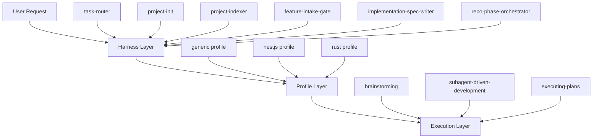

Vai trò của từng lớp:

- `Harness Layer`: route task, giữ rules, tạo spec/plan/tracker, giữ runtime state, cập nhật index
- `Profile Layer`: thêm rule và skill riêng cho từng stack như `nestjs` hoặc `rust`
- `Execution Layer`: nhận phase hiện tại và thực thi code thật

## Modes

| Mode | What you get | Best for |
|---|---|---|
| `Core` | CodexMinimal harness only | user muốn control layer chung, dễ custom |
| `Full` | `Core` + companion skills + active stack profile | user muốn flow đầy đủ ngay |
| `Custom` | `Core` + stage/execution skills/profile riêng | team chuyên sâu, multi-stack |

`install.sh` mặc định chỉ cài `Core`.

## Core Skills

| Skill | Vai trò |
|---|---|
| `task-router` | route request, mode, budget, safety gate |
| `feature-intake-gate` | ép feature intake qua đúng stage |
| `implementation-spec-writer` | viết spec generic trước khi phase planning |
| `project-init` | sync `AGENTS.md`, `docs/ai`, `docs/codexminimal` |
| `project-indexer` | build / repair `docs/ai` indexes |
| `repo-phase-orchestrator` | viết phase plan, tracker, runtime state |

`check-codexminimal.sh` enforces compact skill entrypoints: core skills must stay at or below 200 lines, and optional profile skills must stay at or below 120 lines.

## Profiles

| Layer | Vai trò |
|---|---|
| `generic` | default profile, không áp framework assumption |
| `nestjs` | bật các skill/spec rule dành riêng cho NestJS |
| `rust` | bật các skill/spec rule dành riêng cho Rust |

Active profile nên được lưu ở `docs/ai/stack-profile.md`.

## Companion Skills

| Skill | Vai trò |
|---|---|
| `brainstorming` | clarify intent, constraints, direction |
| `subagent-driven-development` | execution path mặc định sau phase plan |
| `executing-plans` | fallback execution path |

Các skill này là `recommended`, không được cài bởi `install.sh`.

## Flow

### Bootstrap

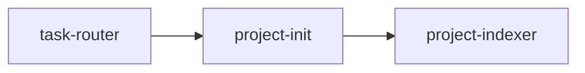

### Feature: Core Mode

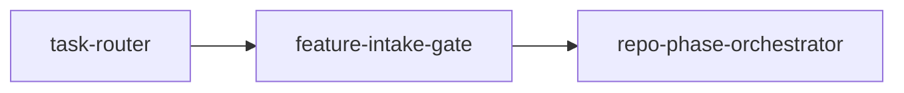

### Feature: Full Mode

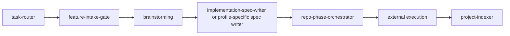

### Optional NestJS Profiles

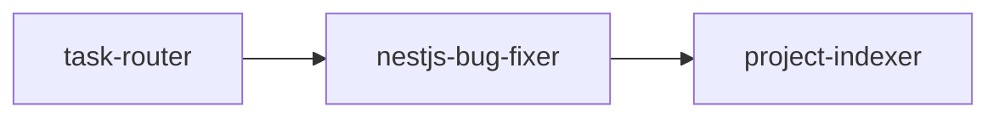

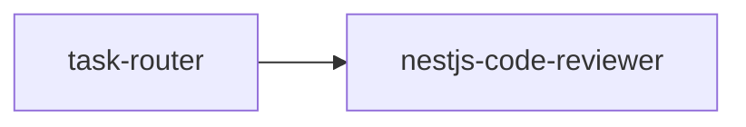

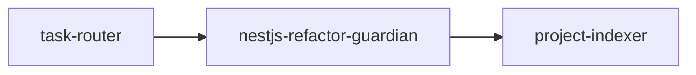

### Optional Rust Profiles

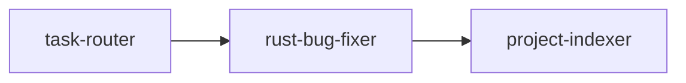

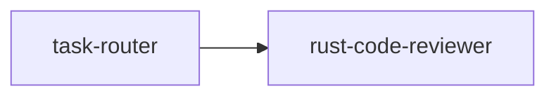

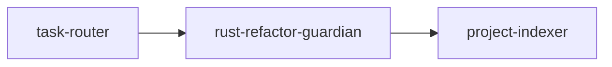

## Artifacts

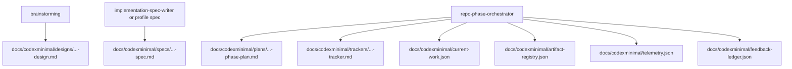

## Helper Layer

Bundled helper path hiện tại:

- `project-init/scripts/sync_agents_blocks.py`
- `project-init/scripts/bootstrap_docs_ai.py`
- `project-init/scripts/bootstrap_harness_runtime.py`
- `project-init/scripts/record_feedback_issue.py`
- `project-init/scripts/promote_feedback_rules.py`
- `project-indexer/scripts/validate_context_map.py`
- `project-indexer/scripts/render_index_stubs.py`

Root-level `scripts/` vẫn có trong source repo để local verification và maintainer workflows.

## Install

```bash
git clone <your-repo-url>
cd CodexMinimal
bash check-codexminimal.sh
bash evals/run-sample-evals.sh
bash install.sh
```

Install thêm NestJS profile:

```bash
CODEXMINIMAL_INSTALL_PROFILES=nestjs bash install.sh
```

Install thêm Rust profile:

```bash
CODEXMINIMAL_INSTALL_PROFILES=rust bash install.sh
```

Install cả NestJS và Rust profiles:

```bash
CODEXMINIMAL_INSTALL_PROFILES=nestjs,rust bash install.sh
```

`install.sh`:

- chạy readiness check ở chế độ gọn; chỉ in full log nếu check fail
- chỉ cài `Core mode`
- cài profile chỉ khi được yêu cầu, ví dụ `CODEXMINIMAL_INSTALL_PROFILES=nestjs`, `CODEXMINIMAL_INSTALL_PROFILES=rust`, hoặc `CODEXMINIMAL_INSTALL_PROFILES=nestjs,rust`
- không overwrite unmanaged skills nếu không có `CODEXMINIMAL_FORCE=1`
- sẽ báo `Full mode available/unavailable` dựa trên companion skills trong `~/.codex/skills` hoặc plugin cache

## Quick Start

Trong repo đích:

```bash
cd /path/to/your-target-repo
```

Prompt đầu tiên:

```text
Use task-router for this repository bootstrap request, then continue the standard bootstrap flow.
```

Sau bootstrap, bạn sẽ có:

- `AGENTS.md`
- `docs/ai/`
- `docs/ai/stack-profile.md`
- `docs/codexminimal/`

Prompt mẫu hằng ngày:

- [Cheat Sheet](docs/cheat-sheet.md)

## Runtime State

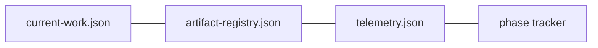

Ba file này giúp harness:

- biết artifact nào đang active
- chặn flow khi plan/tracker stale
- ghi lại phase handoff và verification

## Status

`Current state: local-ready beta`

- local checks: pass
- sample evals: pass
- real-repo trials: chưa phải phần bundle mặc định

## Docs

- [Setup](docs/setup.md)
- [Cheat Sheet](docs/cheat-sheet.md)
- [Architecture](docs/architecture.md)
- [Skills](docs/skills.md)
- [Model Routing](docs/model-routing.md)
- [Model Compatibility](docs/model-compatibility.md)
- [Profiles](docs/profiles.md)
- [Flows](docs/flows.md)
- [Artifacts](docs/artifacts.md)
- [Harness State](docs/harness-state.md)
- [Benchmark](docs/benchmark.md)
- [Evals](docs/evals.md)
- [Release Readiness](docs/release-readiness-plan.md)
