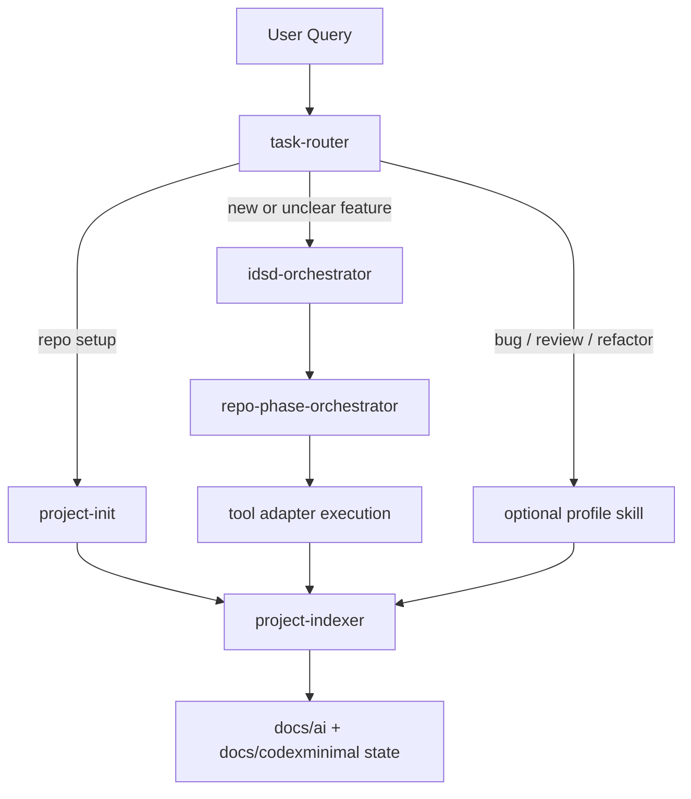
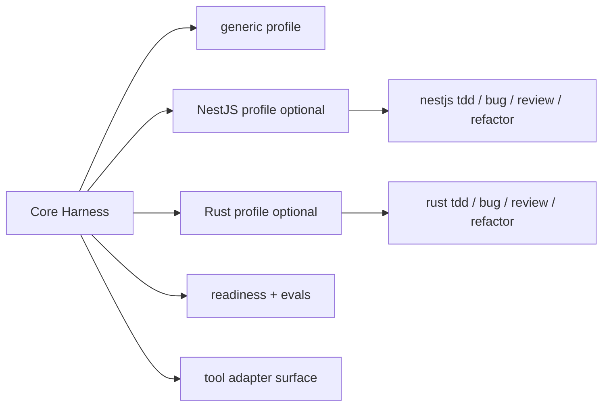
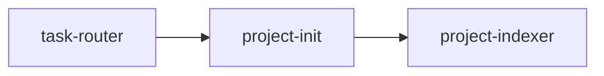
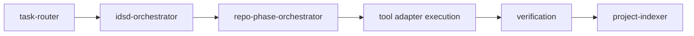
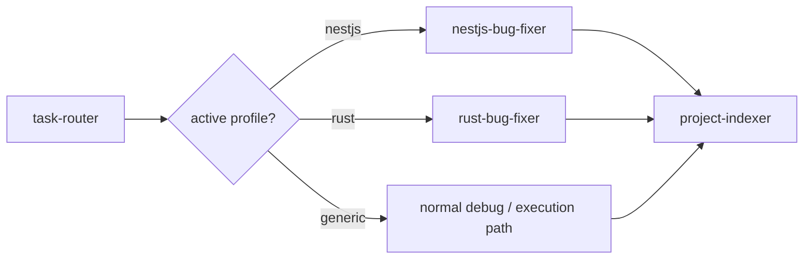
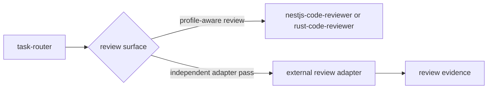
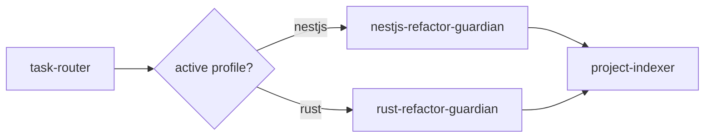
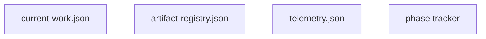

# CodexMinimal

Minimal tool-agnostic harness layer for intent-driven software delivery.

CodexMinimal không cố trở thành một super-agent. Nó là lớp điều phối để giúp LLM làm việc có kiểm soát hơn:

- route request vào đúng workflow nhỏ nhất
- giữ durable rules, project memory và runtime state
- ép feature mới đi qua IDSD pipeline: intent, ADR, bounded spec, tasks, tests, implementation handoff, verification và report
- tách stack-specific workflow như `nestjs` và `rust` khỏi core
- ưu tiên index-first lookup để giảm context scan thừa
- chạy readiness, install smoke test và eval để tránh skill/profile hỏng âm thầm

## System Overview



## Layer Model



| Layer | Vai trò |
|---|---|
| `Core Harness` | route task, giữ rules, tạo intent evidence/plan/tracker, cập nhật index |
| `Profile Layer` | thêm rule và skill riêng cho stack như `nestjs` hoặc `rust` |
| `Execution Layer` | thực thi code thật bằng tool adapter, agent runtime, skill ngoài hoặc flow riêng của team |

Core mặc định không assume repo là NestJS hay Rust. Active profile nên được ghi ở `docs/ai/stack-profile.md`.

## Core Skills

| Skill | Dùng để làm gì |
|---|---|
| `task-router` | phân loại request, chọn workflow, model/effort, context budget và safety gate |
| `idsd-orchestrator` | biến intent thành pipeline package: intent, ADR, bounded spec, tasks, tests, verification và report outline |
| `project-init` | bootstrap hoặc sync `AGENTS.md`, `docs/ai`, `docs/codexminimal` |
| `project-indexer` | tạo/cập nhật index để LLM không scan repo rộng |
| `repo-phase-orchestrator` | tạo phase plan, tracker và runtime state |

Legacy compatibility skills như `feature-intake-gate`, `implementation-spec-writer`, `nestjs-sdd-planner`, và `rust-sdd-planner` chỉ được cài khi dùng `CODEXMINIMAL_INSTALL_PROFILES=legacy`.

`check-codexminimal.sh` enforce skill entrypoint nhỏ: core skills tối đa 200 dòng, optional profile skills tối đa 120 dòng. Policy dài nên nằm trong `references/`.

## Main Flows

### Bootstrap Repo



Dùng khi repo chưa có `AGENTS.md`, `docs/ai`, `docs/codexminimal` hoặc các file này đã stale.

### New Feature



Dùng khi requirement mới, chưa rõ, hoặc thay đổi behavior. Mục tiêu là không để LLM code khi chưa có intent, ADR, bounded specification, task breakdown, test contract, verification evidence và phase boundary.

### Bug Fix



Dùng khi đã có failing test, runtime error, compiler error, panic, regression hoặc behavior sai rõ ràng.

### Code Review



Dùng khi cần findings-only hoặc muốn thêm một lượt review độc lập trước khi merge/push.

### Refactor



Dùng khi move/rename/split module, đổi folder structure hoặc chạm vào boundary dễ gây regression.

## Profiles

| Profile | Khi nào dùng | Skills |
|---|---|---|
| `generic` | default, không áp framework assumption | core skills |
| `nestjs` | repo NestJS hoặc user chọn NestJS | `nestjs-tdd-builder`, `nestjs-bug-fixer`, `nestjs-code-reviewer`, `nestjs-refactor-guardian` |
| `rust` | repo Rust hoặc user chọn Rust | `rust-tdd-builder`, `rust-bug-fixer`, `rust-code-reviewer`, `rust-refactor-guardian` |
| `legacy` | chỉ khi cần tương thích spec-first cũ | `feature-intake-gate`, `implementation-spec-writer`, `nestjs-sdd-planner`, `rust-sdd-planner` |

Design rule:

- profile chỉ bật từ repo evidence rõ hoặc user chỉ định
- framework được phát hiện không tự động kích hoạt profile
- repo Fastify/Express/Rails/Laravel/Django/Go/etc. vẫn dùng `generic` nếu chưa có profile riêng
- stack-specific rules không nhồi vào generic `AGENTS.md`
- `nestjs` và `rust` có thể cài riêng hoặc cùng lúc

## Install

```bash
git clone <your-repo-url>
cd CodexMinimal
bash check-codexminimal.sh
bash evals/run-sample-evals.sh
bash install.sh
```

Cài thêm profile:

```bash
CODEXMINIMAL_INSTALL_PROFILES=nestjs bash install.sh
CODEXMINIMAL_INSTALL_PROFILES=rust bash install.sh
CODEXMINIMAL_INSTALL_PROFILES=nestjs,rust bash install.sh
CODEXMINIMAL_INSTALL_PROFILES=legacy bash install.sh
```

`install.sh`:

- mặc định chỉ cài core
- cài profile chỉ khi có `CODEXMINIMAL_INSTALL_PROFILES`
- không overwrite unmanaged skills nếu không có `CODEXMINIMAL_FORCE=1`
- chạy readiness check gọn trước khi install, trừ khi `CODEXMINIMAL_SKIP_READINESS=1`

## Quick Start In Target Repo

Trong repo đích:

```bash
cd /path/to/your-target-repo
```

Prompt bootstrap:

```text
Use task-router for this repository bootstrap request, then continue the standard bootstrap flow.
```

Sau bootstrap, repo đích sẽ có:

- `AGENTS.md`
- `docs/ai/`
- `docs/ai/stack-profile.md`
- `docs/codexminimal/`

Prompt mẫu hằng ngày nằm ở [docs/cheat-sheet.md](docs/cheat-sheet.md).

Hướng dẫn dùng IDSD trace trong repo đích nằm ở [docs/idsd-usage-guide.md](docs/idsd-usage-guide.md).

## Runtime State



Các file runtime giúp harness:

- biết artifact nào đang active
- phát hiện plan/tracker stale
- ghi lại phase handoff và verification outcome
- tạo nền để đo workflow có giảm exploration waste hay không

## Verification

```bash
bash check-codexminimal.sh
bash evals/run-sample-evals.sh
```

Readiness hiện kiểm tra:

- root files, scripts, JSON/schema
- skill frontmatter và required sections
- line budget cho core/profile skills
- helper scripts và template sync
- install smoke test cho `core`, `nestjs`, `rust`, `nestjs,rust`

## Tool Adapter Usage

Tool adapter là lớp mở rộng optional, không thay thế skill routing mặc định.

| Surface | Dùng để làm gì | Policy |
|---|---|---|
| `eval adapter` | LLM eval có schema, regression capture cho router/planner | opt-in; không chạy trong default readiness |
| `review adapter` | independent code-review pass cho diff/commit/branch | yêu cầu explicit approval khi có thể xuất dữ liệu ra ngoài |
| `diagnostic adapter` | debug môi trường, auth, model, runtime behavior | không chạy trong default readiness |

Adapter contract tối thiểu:

- input rõ: repo root, prompt/case, schema nếu có, policy xuất dữ liệu
- output rõ: JSON hoặc log có thể lưu làm evidence
- failure rõ: exit code, lỗi runtime, lỗi schema, hoặc lỗi policy
- không được làm skills core phụ thuộc vào một tool runtime cụ thể

## Status

`Current state: local-ready beta`

- core harness: ready for local use
- NestJS profile: bundled optional profile
- Rust profile: bundled optional profile
- readiness + sample evals: available
- real-repo dogfood and deeper token/context metrics: intentionally pending

## Documentation

- [Setup](docs/setup.md)
- [Cheat Sheet](docs/cheat-sheet.md)
- [Architecture](docs/architecture.md)
- [Skills](docs/skills.md)
- [Profiles](docs/profiles.md)
- [Flows](docs/flows.md)
- [Artifacts](docs/artifacts.md)
- [Harness State](docs/harness-state.md)
- [Tool Adapter Playbook](docs/tool-adapter-playbook.md)
- [Review Policy](docs/review-policy.md)
- [Evals](docs/evals.md)
- [Benchmark](docs/benchmark.md)
- [Model Routing](docs/model-routing.md)
- [Model Compatibility](docs/model-compatibility.md)
- [Release Readiness](docs/release-readiness-plan.md)
